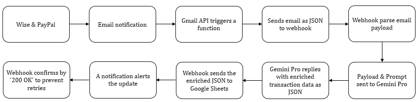

# Technical Documentation: AutoSpendTracker

## 1. Introduction

AutoSpendTracker is a Python-based tool designed to automatically fetch transaction emails from Gmail (specifically Wise and PayPal), extract relevant information using Google's Vertex AI (Gemini model), categorize the spending, and append the structured data to a Google Sheet. It aims to simplify expense tracking across multiple accounts and currencies.

## 2. Architecture Overview

The system follows these steps:

1. **Authentication:** Authenticates with Google services (Gmail, Vertex AI, Sheets) using OAuth 2.0 and Service Accounts.
2. **Email Fetching:** Searches Gmail for specific transaction emails based on sender and keywords.
3. **Email Parsing:** Extracts text content and metadata (like date and sender) from fetched emails.
4. **AI Processing:** Sends parsed transaction information to the Vertex AI Gemini model via a structured prompt to extract and format details like amount, currency, merchant, category, date, time, and account.
5. **Data Validation:** Validates the structure and content of the AI model's response.
6. **Temporary Storage:** Stores successfully processed transactions in a local JSON file ([`transaction_data.json`](../transaction_data.json)).
7. **Sheets Integration:** Appends the data from the JSON file to a designated Google Sheet.
8. **Sheet Formatting:** A Google Apps Script automatically formats new rows added to the sheet.

## 3. Core Components

### 3.1. `gmail_auth.py`

* **Purpose:** Handles authentication with the Gmail API using OAuth 2.0.
* **Key Functions:**
  * [`gmail_authenticate`](../gmail_auth.py): Manages the OAuth 2.0 flow. It checks for existing, valid credentials in [`token.pickle`](../token.pickle). If credentials are missing, invalid, or expired, it initiates the browser-based authorization flow using [`credentials.json`](../credentials.json) and saves the new token. Returns an authorized Gmail API service instance.
* **Dependencies:** `google-auth-oauthlib`, `google-api-python-client`, `google-auth-httplib2`.
* **Files:** Uses [`credentials.json`](../credentials.json) (OAuth Client ID secrets) and [`token.pickle`](../token.pickle) (stores user tokens).

### 3.2. `fetch_mails.py`

* **Purpose:** Searches for and parses transaction emails from Gmail.
* **Key Functions:**
  * [`search_messages`](../fetch_mails.py): Queries the Gmail API for emails from `noreply@wise.com` or `service@paypal.de` containing specific keywords. Returns a list of message IDs.
  * [`get_email_body`](../fetch_mails.py): Retrieves the HTML body content of a specific email message.
  * [`parse_email`](../fetch_mails.py): Takes a message ID, fetches the email content and metadata. Uses BeautifulSoup to parse HTML and regular expressions (`wise_pattern`, `paypal_pattern`) to extract preliminary transaction info (`info`), date (`date`), and determines the account (`account`) based on the sender.
* **Dependencies:** `google-api-python-client`, `beautifulsoup4`, `gmail_auth.py`.

### 3.3. `api.py`

* **Purpose:** Orchestrates the main workflow: fetching emails, processing them with Vertex AI, validating results, and preparing data for Sheets.
* **Key Functions:**
  * [`create_prompt`](../api.py): Constructs a detailed prompt for the Gemini model, instructing it on the desired JSON output format, field requirements, and category rules, including specific hints (`CATEGORY_HINTS`).
  * [`prompt_vertex`](../api.py): Sends the prompt to the configured Gemini model (`gemini-1.5-flash-002`) via the Vertex AI API. Includes retry logic (`tenacity`) for transient errors.
  * [`clean_json_response`](../api.py): Attempts to extract a valid JSON object from the model's potentially messy text response (removing markdown fences, etc.).
  * [`validate_transaction_data`](../api.py): Checks if the parsed JSON data contains all required fields and if the data types/formats (amount, category, date, time) are correct according to `ALLOWED_CATEGORIES` and specified formats.
  * [`process_transaction`](../api.py): Takes the raw parsed info from [`parse_email`](../fetch_mails.py), creates a prompt, calls the AI model, cleans/validates the response, applies category hints, and returns the data as a list suitable for Google Sheets, or `None` on failure.
* **Main Block (`if __name__ == '__main__':`)**:
    1. Initializes Vertex AI using Project ID, Location (from `.env`), and Service Account credentials ([`ASTservice.json`](../ASTservice.json)).
    2. Initializes the Gemini model.
    3. Authenticates with Gmail using [`gmail_authenticate`](../gmail_auth.py).
    4. Calls [`search_messages`](../fetch_mails.py) to find relevant emails.
    5. Iterates through messages, calling [`parse_email`](../fetch_mails.py) and then [`process_transaction`](../api.py).
    6. Collects successful results in `sheet_data`.
    7. Saves `sheet_data` to [`transaction_data.json`](../transaction_data.json).
* **Dependencies:** `google-cloud-aiplatform`, `python-dotenv`, `tenacity`, `fetch_mails.py`, `gmail_auth.py`.
* **Files:** Uses [`ASTservice.json`](../ASTservice.json) (Service Account key), reads `.env`, writes to [`transaction_data.json`](../transaction_data.json).

### 3.4. `sheets_integration.py`

* **Purpose:** Appends the processed transaction data to Google Sheets.
* **Key Functions:**
  * [`sheets_service`](../sheets_integration.py): Authenticates with the Google Sheets API using Service Account credentials ([`ASTservice.json`](../ASTservice.json)) and returns a Sheets API service instance.
  * [`append_to_sheet`](../sheets_integration.py): Takes the spreadsheet ID, range name, and data (list of lists) and appends it to the specified sheet using the `values().append()` method.
* **Main Block (`if __name__ == '__main__':`)**:
    1. Reads the processed data from [`transaction_data.json`](../transaction_data.json).
    2. Calls [`append_to_sheet`](../sheets_integration.py) to upload the data.
* **Dependencies:** `google-api-python-client`, `google-auth`, `python-dotenv`.
* **Files:** Uses [`ASTservice.json`](../ASTservice.json), reads `.env` (for `SPREADSHEET_ID`, `RANGE_NAME`), reads [`transaction_data.json`](../transaction_data.json).
* **Note:** This script is run *after* `api.py` completes successfully and generates [`transaction_data.json`](../transaction_data.json). The current structure doesn't automatically run this; it needs to be executed separately or integrated into the main flow of `api.py`.

### 3.5. `sheet.gs`

* **Purpose:** Google Apps Script attached to the target Google Sheet to automatically format new rows.
* **Key Functions:**
  * [`formatSheet`](../sheet.gs): Selects the data range (`A2:G`), sets font family, size, weight, alignment, and specific font colors for date/time columns.
  * [`createOnEditTrigger`](../sheet.gs): Sets up a trigger so that [`formatSheet`](../sheet.gs) runs automatically whenever the sheet is edited (i.e., when new data is appended).
* **Environment:** Runs within the Google Sheets environment.

## 4. Authentication Details

* **Gmail API:** Uses OAuth 2.0 for user consent to read emails. Requires [`credentials.json`](../credentials.json) (downloaded from Google Cloud Console) and stores refresh/access tokens in [`token.pickle`](../token.pickle). The user needs to authorize the application via a browser on the first run.
* **Vertex AI & Google Sheets API:** Uses a Service Account ([`ASTservice.json`](../ASTservice.json)). This avoids needing user interaction for these APIs. The service account needs appropriate IAM roles (e.g., Vertex AI User, Google Sheets Editor) in the Google Cloud project.

## 5. Data Flow Summary

1. [`api.py`](../api.py) starts.
2. [`gmail_auth.py`](../gmail_auth.py) authenticates Gmail access.
3. [`fetch_mails.py`](../fetch_mails.py) searches for emails via Gmail API.
4. For each email found:
    * [`fetch_mails.py`](../fetch_mails.py) parses basic info.
    * [`api.py`](../api.py) creates a prompt with the info.
    * [`api.py`](../api.py) calls Vertex AI API (using Service Account auth).
    * [`api.py`](../api.py) cleans and validates the JSON response.
    * Valid data is added to a list.
5. [`api.py`](../api.py) writes the list of valid transactions to [`transaction_data.json`](../transaction_data.json).
6. (Manually or via separate execution) [`sheets_integration.py`](../sheets_integration.py) runs.
7. [`sheets_integration.py`](../sheets_integration.py) reads [`transaction_data.json`](../transaction_data.json).
8. [`sheets_integration.py`](../sheets_integration.py) authenticates Sheets access (using Service Account).
9. [`sheets_integration.py`](../sheets_integration.py) appends data to the Google Sheet.
10. [`sheet.gs`](../sheet.gs) `onEdit` trigger fires, formatting the newly added rows.

## 6. Configuration

* Environment variables are managed using a `.env` file, loaded via `python-dotenv`.
* [`.env.example`](../.env.example) provides a template.
* Key variables:
  * `PROJECT_ID`: Google Cloud Project ID.
  * `LOCATION`: Google Cloud region for Vertex AI.
  * `SERVICE_ACCOUNT_FILE`: Path to the Service Account JSON key file (e.g., [`ASTservice.json`](../ASTservice.json)).
  * `SPREADSHEET_ID`: The ID of the target Google Sheet.
  * `RANGE_NAME`: The sheet and range where data should be appended (e.g., `Sheet1!A2:G`).

## 7. Dependencies

Key Python libraries listed in [`requirements.txt`](../requirements.txt):

* `google-auth-oauthlib`, `google-auth-httplib2`, `google-api-python-client`: For Google API authentication and interaction.
* `google-cloud-aiplatform`: For Vertex AI API interaction.
* `beautifulsoup4`: For parsing HTML email content.
* `python-dotenv`: For loading environment variables from `.env`.
* `requests`: HTTP library (likely a dependency of Google libraries).
* `tenacity`: For adding retry logic to API calls.

## 8. Setup and Execution

1. **Clone:** Get the project code.
2. **Environment:** Create and activate a Python virtual environment.
3. **Install:** `pip install -r requirements.txt`
4. **Configure Google Cloud:**
    * Create a Google Cloud Project.
    * Enable Gmail API, Google Sheets API, Vertex AI API.
    * Create OAuth 2.0 Client ID credentials, download as `credentials.json`.
    * Create a Service Account, grant necessary roles (Vertex AI User, Sheets Editor), download the key as `ASTservice.json` (or the name specified in `.env`).
5. **Configure `.env`:** Copy [`.env.example`](../.env.example) to `.env` and fill in `PROJECT_ID`, `LOCATION`, `SPREADSHEET_ID`, `RANGE_NAME`, and ensure `SERVICE_ACCOUNT_FILE` points to your key file.
6. **Configure Google Sheet:** Create a Google Sheet, note its ID. Add the script from [`sheet.gs`](../sheet.gs) via "Extensions" > "Apps Script", save it, and run [`createOnEditTrigger`](../sheet.gs) once to set up the trigger (requires authorization). Ensure the sheet name matches the `RANGE_NAME` in `.env`.
7. **First Run (Gmail Auth):** Run `python gmail_auth.py` or `python api.py`. This should trigger the OAuth flow in your browser for Gmail access. Authorize it. [`token.pickle`](../token.pickle) will be created.
8. **Run Main Processing:** `python api.py`. This fetches emails, processes them via AI, and saves results to [`transaction_data.json`](../transaction_data.json). Check logs for progress and errors.
9. **Upload to Sheets:** `python sheets_integration.py`. This reads [`transaction_data.json`](../transaction_data.json) and appends data to the configured Google Sheet.

## 9. Key Files Recap

* [`api.py`](../api.py): Main orchestration script.
* [`fetch_mails.py`](../fetch_mails.py): Gmail searching and parsing.
* [`gmail_auth.py`](../gmail_auth.py): Gmail OAuth 2.0 handling.
* [`sheets_integration.py`](../sheets_integration.py): Uploads data to Google Sheets.
* [`sheet.gs`](../sheet.gs): Google Apps Script for sheet formatting.
* [`requirements.txt`](../requirements.txt): Python dependencies.
* [`.env`](../.env): Environment variables (API keys, IDs). (Not committed)
* [`credentials.json`](../credentials.json): Gmail API OAuth client secrets. (Not committed)
* [`token.pickle`](../token.pickle): Stored Gmail API user tokens. (Not committed)
* [`ASTservice.json`](../ASTservice.json): Service Account key for Vertex AI/Sheets. (Not committed)
* [`transaction_data.json`](../transaction_data.json): Temporary storage for processed transactions before sheet upload. (Not committed)
* [`README.md`](../README.md): General project overview and user setup guide.